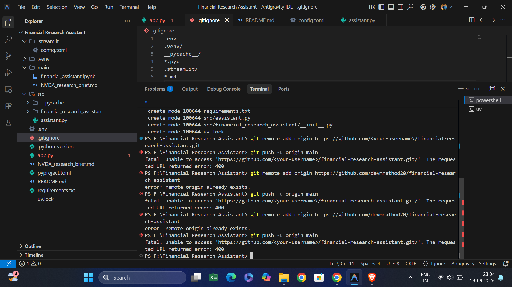

# 📈 AlphaTerminal: Autonomous Financial Research Assistant

[](https://www.python.org/)
[](https://www.langchain.com/)
[](https://github.com/langchain-ai/langgraph)
[](https://groq.com/)
[](https://streamlit.io/)
[](https://github.com/astral-sh/uv)

---



An enterprise-grade, agentic financial analyst that pairs deterministic SEC-audited statements with qualitative web intelligence and mathematical simulation engines. Built to eliminate hallucination in equity research workflows.

---

## 🏛️ System Architecture

                           ┌─────────────────────────┐
                           │   Streamlit Web UI      │
                           │  (app.py / Glassmorphic)│
                           └────────────┬────────────┘
                                        │ User Query
                                        ▼
                           ┌─────────────────────────┐
                           │   LangChain v1 Agent    │
                           │  (llama-3.1-8b-instant) │
                           └────────────┬────────────┘
                                        │ Tool Routing & State Management
              ┌─────────────────────────┼─────────────────────────┐
              ▼                         ▼                         ▼
    ┌───────────────────┐     ┌───────────────────┐     ┌───────────────────┐
    │  yFinance SEC     │     │   Tavily Search   │     │  Compound Growth  │
    │  Grounding Tool   │     │ Qualitative News  │     │   Math Engine     │
    │ (Audited 10-Q/K)  │     │  & Market Trends  │     │ (Pydantic Schema) │
    └───────────────────┘     └───────────────────┘     └───────────────────┘
             │                         │                         │
             └─────────────────────────┼─────────────────────────┘
                                       ▼
                         ┌─────────────────────────┐
                         │   File Export Engine    │
                         │ (Markdown Brief Writer) │
                         └─────────────────────────┘

### Key Engineering Pillars
- **Deterministic SEC Grounding (`get_quarterly_financials`):** Queries audited balance sheets and income statements directly via Yahoo Finance (`yfinance`), resolving hallucinated metrics common to web scrapers.
- **Short-Term Checkpointing (`InMemorySaver`):** Retains session state and thread history to enable natural coreference resolution across conversational turns (e.g., tracking tickers implicitly).
- **Context Engineering (`SummarizationMiddleware`):** Dynamically compacts long conversational histories into progressive summaries once message boundaries are reached.
- **Deterministic Math (`compound_growth_calculator`):** Offloads multi-year compound interest projections to a typed Pydantic calculation tool rather than relying on probabilistic LLM arithmetic.
- **Action Artifacts (`export_financial_report`):** Compiles multi-turn research briefs and writes structured Markdown files directly to the root workspace.

---

## 📦 Tech Stack

| Component | Technology | Purpose |
| :--- | :--- | :--- |
| **LLM Inference** | Groq (`llama-3.1-8b-instant`) | Ultra-low-latency tool-calling inference |
| **Orchestration** | LangChain v1, LangGraph | Cyclic agent execution and session checkpointing |
| **Financial Grounding** | `yfinance` | Direct extraction of audited quarterly filings |
| **Market Intelligence**| Tavily Search API | Targeted search for macro catalysts and company updates |
| **Frontend UI** | Streamlit | Glassmorphic dark terminal interface |
| **Validation** | Pydantic v2 | Enforced schemas for tool execution arguments |
| **Environment** | `uv` | Dependency resolution and fast project management |

---

## 📂 Project Structure

```text
financial-research-assistant/
├── .streamlit/
│   └── config.toml          # Custom dark terminal theme configuration
├── src/
|    └── financial_research_assistant/
│        ├── __init__.py
│        └── assistant.py         # Agent graph, tools, checkpointer, and execution logic
├── app.py                   # Streamlit web application interface
├── pyproject.toml           # Project dependencies managed via uv
├── requirements.txt         # Standard requirements export for cloud platforms
├── .gitignore               # Secret protection (.env, .venv, build artifacts)
└── README.md                # Project documentation

🚀 Quickstart
1. Prerequisites
Python 3.12+

uv installed on your system

2. Clone & Install
Bash
git clone [https://github.com/devmrathod20/financial-research-assistant.git](https://github.com/devmrathod20/financial-research-assistant.git)
cd financial-research-assistant
uv sync
3. Configure API Credentials
Create a .env file in the root directory:

Code snippet
GROQ_API_KEY="your-groq-api-key"
TAVILY_API_KEY="your-tavily-api-key"
4. Launch the Web Terminal
Bash
uv run streamlit run app.py
Open your browser at http://localhost:8501.

🧪 Verification Walkthrough
Audited Financials Retrieval:

"What are the latest audited revenue and net income figures for NVIDIA (NVDA)?"

Triggers get_quarterly_financials and returns actual SEC-filed statements.

Implicit Coreference & Calculation:

"If I invest $10,000 in this stock and add $2,000/year at 10% for 5 years, what would the portfolio be worth?"

Resolves "this stock" to NVDA via state memory and computes deterministic returns via compound_growth_calculator.

Artifact Export:

"Export this complete analysis into a report for NVDA."

Triggers export_financial_report to generate NVDA_research_brief.md, enabling direct downloads from the sidebar.

🛡️ Engineering Safeguards
Tool Hallucination Defenses: Model system prompts restrict tool calls strictly to bound schemas, preventing invalid API calls.

Fail-Safe Tool Loops: The execution wrapper limits agent recursion depth to prevent infinite search loops.

Credential Protection: Git tracking excludes .env and local cache directories by default.

📄 License
This project is open-source and available under the MIT License.
